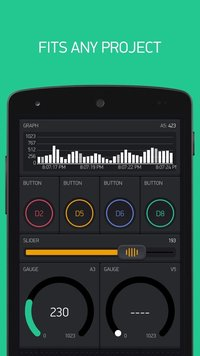

# PiBlynk
"BETA" - as at 1 June 2017 - as a public GIT project being ported up from a local class project, these files are still being frequently edited.

Javascript and Python libraries for using Blynk APP on Raspberry Pi.
Two working libraries designed to easily connect with the Blynk smartphone APP.

The libraries are designed specifically for Raspberry Pi. The overall design target is for:

1. stability in connection to server
1. full suite of interfacing functions
1. similarity of functions/functionality in the two versions, as far as the languages allow 
1. easy compatibility with Raspberry Pi GPIO and PiCamera

Both are forked code, “standing on the shoulders of others.”

# Features (both versions) include:
* Automatic connecting to Blynk server, and maintaining that connection.
* Full suite of functions for interfacing to GPIO and virtual pins of the Blynk protocol.
* Widget object for LCD
* Widget for GPS (with distance and direction), 
* Widget for accelerometer (with pitch and roll)
* Generic buffering widget for any sensor pushing data from APP (eg lightmeter)
* Send email, tweet, smartphone notification.
* Change phone widget properties (colour, label)
* Widget for a “bridge”, ie gpio or virtual commands to another hardware device.
* Compatible with PiCamera
* Extensive example files.

# Specific to javascript version:
* Uses OnOff gpio module to allow simplistic GPIO in and out without specific coding.
* Compatible also with rpio and pigpio modules as more competent GPIO libraries.
* Connects to Blynk server in plain TCP or in SSL.

The javascript version requires nodejs greater than either 0.10.x as distributed on Raspbian, or the 0.12.x as found on https://node-arm.herokuapp.com/.  I upgraded my nodejs using the recommended **update-nodejs-and-nodered** as per https://nodered.org/docs/hardware/raspberrypi to 6.x.  Unfortunately I find that all the later versions of nodejs (past 0.12.x) seem to run only on my Raspberry Pi 3 (armv7), but not on my new Pi zero-W (armv6). On the RPi3, the javascript Blynk code works great. The javascript version is inherently single-threaded.

[API? See here](piblynk-js.md)  

# Specific to python version:
* By default, “hardware agnostic”. Operates on any linux, and probably on Windows (unchecked)
* No default GPIO library. Operates comfortably with gpiozero module.
* Python (2) or python 3.
* TCP connection, but no SSL.
* User Tasks, ie interval timer, threaded/concurrent
* One-shot Timer functions, threaded/concurrent
* Reentrancy protection for threaded “write” calls.
* Simple “Ticker” periodic function (not threaded)

The python version runs fine on any version of RPi. It uses threading/timers for user code. It should easily adapt to any linux machine, and probably to a windows python too.

[API? See here](PiBlynk-py.md)  

# Installation:
These libraries were prepared for a classroom, and I train my students using basic low-brow skills involving geany IDE and command terminal. I am leaving the library files in the same format/structure here.

I am suggesting simple manual download as a zip file, and "extract-here". The two separate project workspaces are in folders **piblynk-js** and **PiBlynk-py**, and you can move them to wherever you normally put your user projects.

In both libraries you will need to edit your blynk AUTH TOKEN for your RPi device into file **mytoken.py** or **mytoken.js**.

### NodeJS version:
The folder node_modules/piblynk holds the library code. You will additionally need to use npm to install locally several support modules. Adjust this command to wherever is your workspace: 

xxx@xxx ~/Documents/NodejsScripts $ **npm install onoff bindings coffee-script epoll underscore**

And by all means, it that's in your usual practice, install these modules instead to nodejs' global area.

Load any example file into geany. Click Build/Set Build Commands and check that the execute command is set to  **nodejs %f**   

In geany, clicking the **Run or View Current File** icon should execute it, and connect to the blynk server.

### Python version:

The folder PiBlynk holds the library code. You should have (or create) an **images** folder parallel to PiBlynk if you are going to use the camera example.

Load any example file into geany. Click Build/Set Build Commands and check that the execute command is set to  **python %f** or preferably **python3 %f**   

Click the **Run or View Current File** icon to execute your example, and to connect to the blynk server.
  
    
# Examples, and Test Hardware used:

[See separate file](test_hardware.md)

# Attributions:

The PiBlynk-py library was inspired by, and leveraged from, the work of the WIPY project.
   [https://github.com/wipy/wipy/blob/master/lib/blynk/BlynkLib.py](https://github.com/wipy/wipy/blob/master/lib/blynk/BlynkLib.py)  
and thence from  
   [https://github.com/youngsoul/BlynkLib](https://github.com/youngsoul/BlynkLib)

The piblynk-js library was derived from:   
     [https://github.com/vshymanskyy/blynk-library-js](https://github.com/vshymanskyy/blynk-library-js)  
    MIT licence

