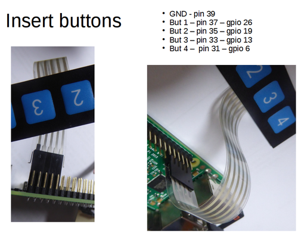
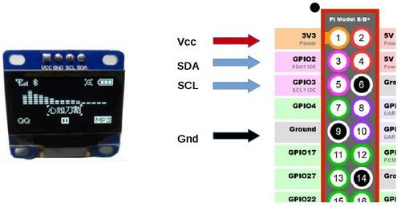
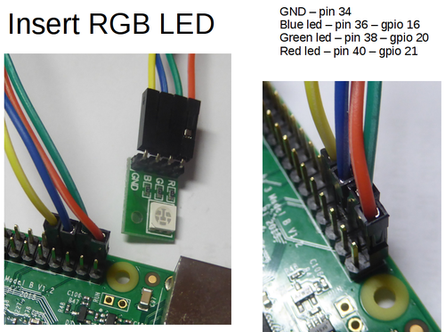
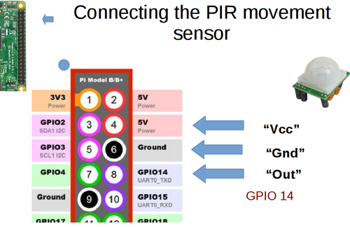

# PiBlynk

# Hardware used in the Example Files:

The two files PiBlynk-py.md and piblynk-js.md list the example files supplied. These were used in a classroom where students had already connected these devices:

* GPIO21   out to Red Led
* GPIO20   out Green Led
* GPIO16   out Blue Led
* GPIO14   in from PIR sensor
* GPIO13     Button1/pullup
* GPIO6     Button2/pullup
* GPIO26    Button3/pullup
* GPIO19     Button4/pullup
* GPIO2/GPIO3 I2C with OLED display
* camera

(The OLED functions use libraries separately listed on github.)

# APP Widgets

If you run the "includes everything" example file (either python or javascript) then here are all the wisgets to set on your smartphone APP. Caution: it will consume over 7000 blynk "energy" credits to do these all together! You get only 2000 for free, and more will cost you money.

- GPIO21 out to Red Led – Button widget
- GPIO20 out Green Led -- Button
- GPIO16 out Blue Led – Button for some examples, slider for others
- V1 Button1/pullup – Value display widget
- V2 Button2/pullup in on GPIO6 – LED widget
- V3 Button3/pullup in on GPIO26 -- LED
- V4 Button4/pullup in on GPIO19 -- LED
- V8 slider 0-100 for blue led pwm
- V9 Gauge scaled 0-1 – readback of blue led
- brightness
- V10 RPI time sent to phone – Value display
- V11 GPS widget
- V12 value display for GPS distance calc
- V13 Terminal widget for OS shell commands
- V14 Terminal widget for python interpreter
- V15 Flashing “active” – LED
- V17 Accel widget
- V18 Message logger to APP – Terminal widget (uses
- output box. Disable input box)
- V19 Journal logger APP to RPi OLED – Terminal
- (use input box)
- V20 Joystick widget to RPi. -- Joystick widget.
- V24 Proximity sensor from APP
- V25 Light level sensor from APP
- V26 Button for cam stillshot
- V27 Value display for camshot feedback to APP
- V30 Button to control RPI’s PCB led
- V33 LCD widget
- Notification widget (for PIR alerts).

